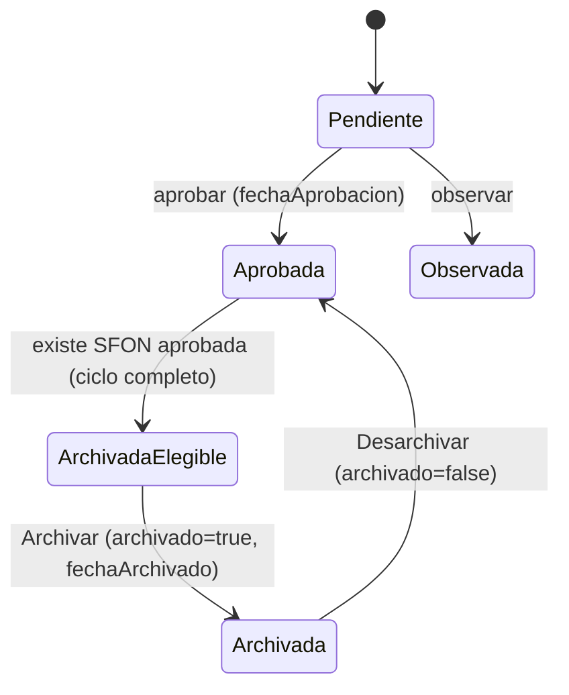

# Phase 1 — Data Model: Archivado de Solicitudes por Mes

**Feature**: `001-archivar-solicitudes` | **Date**: 2026-07-28

> El proyecto **no tiene base de datos**. El "modelo" es el JSON embebido en `Task.notes` (ver `specs/modelo-de-datos.md`). Esta funcionalidad **extiende** la entidad `solicitud_json` de forma retrocompatible; no crea entidades nuevas persistidas.

---

## 1. Extensión de la entidad `Solicitud` (JSON en `Task.notes`)

Se añaden dos campos opcionales al objeto JSON de una solicitud (tabla lógica **T6 · `solicitud_json`**):

| Campo | Tipo | Requerido | Descripción | Restricciones |
|---|---|---|---|---|
| `archivado` | `boolean` | No | `true` si la solicitud fue archivada. Ausente/`false` ⇒ no archivada. | Solo puede ser `true` en una solicitud **aprobada** (con `fechaAprobacion`) cuyo ciclo SMAT↔SFON está aprobado. |
| `fechaArchivado` | `string` | No | Marca temporal del archivado, formato `DD/MM/YYYY, HH:mm` en zona `America/La_Paz`. | Presente si `archivado === true`. Solo informativa (no se usa para agrupar). |

**Retrocompatibilidad**: Las solicitudes existentes no tienen estos campos; se interpretan como `archivado = false`. Al desarchivar se puede fijar `archivado = false` (o eliminar el campo) y limpiar `fechaArchivado`.

### Ejemplo de bloque JSON (fragmento relevante)

```json
{
  "titulo": "Compra de materiales taller",
  "area": "Erradicación de Violencia",
  "fechaSolicitud": "10/07/2026, 09:15",
  "fechaAprobacion": "12/07/2026, 14:30",
  "archivado": true,
  "fechaArchivado": "28/07/2026, 11:05",
  "materiales": []
}
```

---

## 2. Entidad de vista efímera: `SeccionMes` (no persistida)

Agrupación calculada al renderizar la pestaña "Archivadas". No se guarda en ningún lado.

| Atributo | Tipo | Descripción |
|---|---|---|
| `clave` | `string` | Clave estable de orden, formato `YYYY-MM` (o `sin-fecha`). |
| `etiqueta` | `string` | Texto legible en español (ej. "Julio 2026", "Sin fecha"). |
| `solicitudes` | `SolicitudRow[]` | Filas archivadas del mes (grupos SMAT+SFON). |
| `conteo` | `number` | Número de solicitudes/grupos del mes. |
| `expandido` | `boolean` | Estado UI de expansión (controlado por `Collapse`; inicia colapsado). |

**Reglas de derivación**:
- La clave/mes se obtiene de `fechaAprobacion` de la SMAT del grupo (D4).
- Orden de secciones: descendente por `clave` (más reciente primero); "Sin fecha" al final.
- Orden interno: descendente por `fechaAprobacion` (FR-010).
- Meses sin coincidencias tras aplicar la búsqueda no se muestran (FR-014).

---

## 3. Estado de UI (React) — no persistido

Nuevos estados en `HomePage.tsx` (o su extracción):

| Estado | Tipo | Propósito |
|---|---|---|
| `solicitudesArchivadas` | `SolicitudRow[]` | Filas con `archivado === true`. |
| `searchArchivadas` | `string` | Término de búsqueda de la pestaña. |
| `archivandoKey` / `desarchivandoKey` | `string \| null` | Fila en proceso (spinner/disable), análogo a `approvingGid`. |
| `mesesExpandidos` | `string[]` | Claves de meses expandidos (`activeKey` de `Collapse`). |

El tipo `SolicitudRow` existente no cambia estructuralmente; el atributo de archivado se lee de `row.task.notes` vía `extractJsonData`.

---

## 4. Transiciones de estado de una Solicitud



**Invariantes**:
- `archivado === true` ⇒ la solicitud está aprobada y su ciclo SFON aprobado (RN-11 + D3).
- Archivar/desarchivar afecta **ambas** subtareas del grupo SMAT+SFON de forma atómica a nivel de UI (D8): el estado local solo cambia si ambas escrituras `updateTask` tienen éxito.
- Ninguna solicitud aparece simultáneamente en "Aprobadas" y "Archivadas".

---

## 5. Trazabilidad requisitos → modelo

| Requisito | Elemento de modelo |
|---|---|
| FR-002/FR-004 | `archivado`, `fechaArchivado`; lista `solicitudesArchivadas` |
| FR-003/FR-011 | Invariante de grupo SMAT+SFON aprobado |
| FR-005/FR-006 | Transición Archivada→Aprobada preservando el resto del JSON |
| FR-007/FR-008/FR-009/FR-010 | Entidad `SeccionMes` (clave/etiqueta/orden) |
| FR-012 | Exclusión de archivadas del `dataSource`/conteo de Aprobadas |
| FR-014 | Filtro `searchArchivadas` sobre `SeccionMes` |
| FR-015 | Persistencia en `notes` + default no archivado |
| FR-016 | Sección "Sin fecha" |

---

**Nota de sincronización de documentación**: Al implementar, actualizar `specs/modelo-de-datos.md` (tabla T6 · `solicitud_json`) para incluir `archivado` y `fechaArchivado`, conforme al Principio VI de la constitución.
