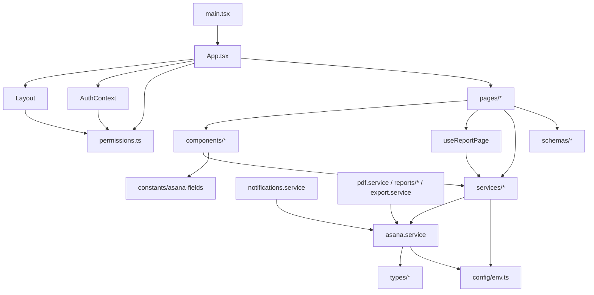
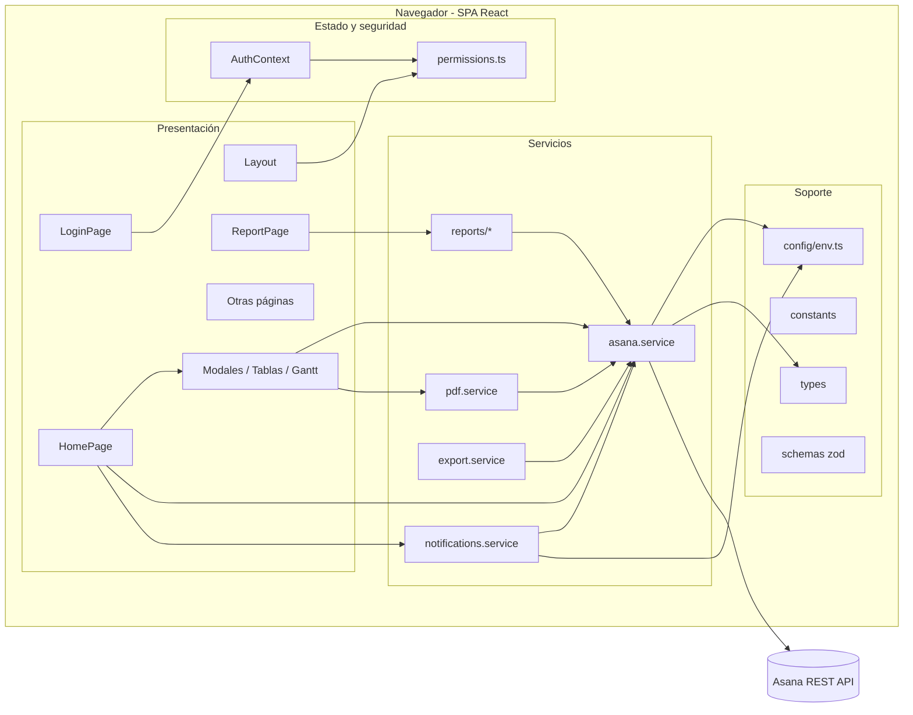
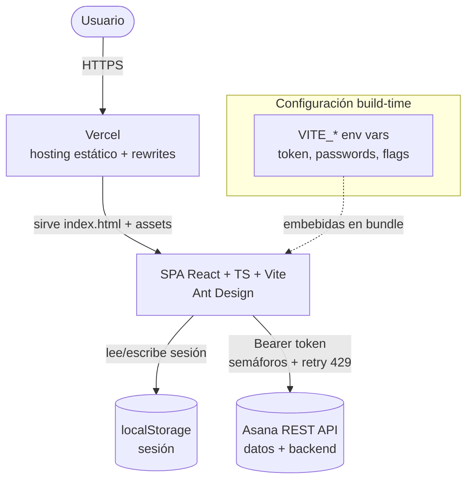

# Documentación Técnica — Arquitectura Actual

> Documento de **ingeniería inversa** del repositorio `cdima-reportes`. Describe **únicamente lo que existe hoy**. No propone mejoras ni rediseños.

---

## 1. Descripción general del sistema

Aplicación **SPA (Single Page Application)** de gestión y reportería para CDIMA, construida con **React 18 + TypeScript + Vite**. Funciona como una **capa de gestión sobre Asana**: usa el API REST de Asana como **única fuente de datos y backend** (no hay servidor propio ni base de datos).

Cubre: seguimiento de proyectos, solicitudes (material/fondos/devolución), contrataciones, planificación (Gantt/calendario), biblioteca de recursos, y módulos académicos (escuelas, diplomados, cursos de alto nivel), además de generación de reportes en PDF/Word/CSV.

- **Tipo**: SPA cliente-only (renderizado en navegador).
- **Persistencia**: Asana (tareas con JSON embebido + campos personalizados).
- **Autenticación**: local, usuarios hardcodeados, sesión en `localStorage`.
- **Despliegue**: estático (Vercel) con rewrites SPA.

---

## 2. Arquitectura

**Estilo**: SPA por capas en el cliente, sin backend intermedio. El navegador habla **directamente** con el API de Asana usando un Personal Access Token.

```
┌───────────────────────────────────────────────┐
│                   Navegador                     │
│                                                 │
│  UI (páginas + componentes Ant Design)          │
│        │                                        │
│  Estado/Contexto (AuthContext, permissions)     │
│        │                                        │
│  Hooks (useReportPage)                          │
│        │                                        │
│  Capa de servicios                              │
│   ├─ asana.service (acceso API, semáforos)      │
│   ├─ notifications.service                       │
│   ├─ pdf.service / reports/* / export.service   │
│        │                                        │
│  Config (env.ts) · Utils · Schemas (zod)        │
└─────────┼───────────────────────────────────────┘
          │ HTTPS + Bearer token
          ▼
   ┌──────────────┐
   │  Asana REST  │  (fuente de datos / "backend")
   └──────────────┘
```

**Capas**:
1. **Presentación**: páginas (`pages/`) + componentes reutilizables (`components/`), Ant Design.
2. **Estado/seguridad**: `context/` (AuthContext + permissions/roles).
3. **Lógica de aplicación**: hooks (`hooks/`) y lógica embebida en páginas.
4. **Servicios/dominio**: `services/` (acceso a Asana, reportes, notificaciones, export).
5. **Infraestructura/soporte**: `config/`, `utils/`, `constants/`, `schemas/`, `types/`.

---

## 3. Responsabilidad de cada módulo

### 3.1 Entrada y ruteo
| Módulo | Responsabilidad |
|---|---|
| [src/main.tsx](../src/main.tsx) | Punto de entrada; monta React en el DOM |
| [src/App.tsx](../src/App.tsx) | Router (`react-router-dom`), `ProtectedRoute`/`PublicRoute`, `ErrorBoundary`, `AuthProvider` |
| [src/components/Layout.tsx](../src/components/Layout.tsx) | Layout, navegación por rol (`ROLE_PAGES`), filtros de menú |
| [src/components/ErrorBoundary.tsx](../src/components/ErrorBoundary.tsx) | Captura de errores de render |

### 3.2 Contexto / seguridad
| Módulo | Responsabilidad |
|---|---|
| [src/context/AuthContext.tsx](../src/context/AuthContext.tsx) | Usuarios hardcodeados, login/logout, sesión en `localStorage`, helpers (`getAprobadorEmails`, `getSolicitanteByEmail`, `getCargoByEmail`) |
| [src/context/permissions.ts](../src/context/permissions.ts) | Roles, permisos (`ROLE_PERMISSIONS`), páginas por rol (`ROLE_PAGES`), restricción de área (`ROLE_ESCUELA_AREA`) |

### 3.3 Páginas (`pages/`)
| Página | Ruta | Responsabilidad |
|---|---|---|
| [HomePage.tsx](../src/pages/HomePage.tsx) | `/` | Dashboard: solicitudes, contrataciones, atrasadas, KPIs, campana de notificaciones |
| [ReportPage.tsx](../src/pages/ReportPage.tsx) | `/report` | Reporte/ficha de actividades y subactividades |
| [ResourceLibraryPage.tsx](../src/pages/ResourceLibraryPage.tsx) | `/biblioteca` | Biblioteca de recursos (adjuntos) |
| [PlanningPage.tsx](../src/pages/PlanningPage.tsx) | `/planificacion` | Planificación, Gantt, calendario |
| [EscuelasPage.tsx](../src/pages/EscuelasPage.tsx) | `/escuelas` | Gestión académica de escuelas |
| [DiplomadosPage.tsx](../src/pages/DiplomadosPage.tsx) | `/diplomados` | Gestión de diplomados |
| [ProduccionAltoNivelPage.tsx](../src/pages/ProduccionAltoNivelPage.tsx) | `/produccion-alto-nivel` | Cursos de alto nivel |
| [InvestigacionIncidenciaPage.tsx](../src/pages/InvestigacionIncidenciaPage.tsx) | `/investigacion-e-incidencia` | Documentos de investigación/incidencia |
| [PublicacionesPage.tsx](../src/pages/PublicacionesPage.tsx) | `/publicaciones` | Publicaciones |
| [LoginPage.tsx](../src/pages/LoginPage.tsx) | `/login` | Autenticación |
| [ConfiguracionPage.tsx](../src/pages/ConfiguracionPage.tsx) | — | Configuración (no ruteada en `App.tsx`) |
| [ProjectTasksListPage.tsx](../src/pages/ProjectTasksListPage.tsx) | — | Listado de tareas (no ruteada en `App.tsx`) |

### 3.4 Servicios (`services/`)
| Servicio | Responsabilidad |
|---|---|
| [asana.service.ts](../src/services/asana.service.ts) | Cliente del API de Asana: `fetchAsana`, semáforos de concurrencia, retry 429, CRUD de tareas/proyectos/secciones/subtareas/adjuntos, caché de workspaces |
| [notifications.service.ts](../src/services/notifications.service.ts) | Notificaciones (feature flag) sobre proyecto `NOTIFICACIONES` |
| [pdf.service.ts](../src/services/pdf.service.ts) | Reportes PDF (jsPDF + autotable): solicitudes, beneficiarios, distribución, ficha |
| [export.service.ts](../src/services/export.service.ts) | Exportación CSV compatible con Asana |
| [reports/](../src/services/reports/) | Reportes por dominio (actividad, ficha, Gantt, planificación, escuelas, diplomados, alto nivel) en PDF y Word (`docx`) |

### 3.5 Soporte
| Módulo | Responsabilidad |
|---|---|
| [src/config/env.ts](../src/config/env.ts) | Configuración desde `import.meta.env`, feature flag de notificaciones |
| [src/constants/asana-fields.ts](../src/constants/asana-fields.ts) | Nombres de campos personalizados de Asana |
| [src/types/](../src/types/) | Tipos (`asana.types.ts`, `notification.types.ts`, `autotable.d.ts`, `images.d.ts`) |
| [src/schemas/diplomado.schemas.ts](../src/schemas/diplomado.schemas.ts) | Validación con `zod` |
| [src/hooks/useReportPage.ts](../src/hooks/useReportPage.ts) | Lógica reutilizable de la página de reportes |
| [src/utils/](../src/utils/) | `asana-helpers.ts`, `colors.ts` |
| [utils/](../utils/) | Scripts Node de respaldo (`backup.js`, `backup-proy.js`, `backup-cursos.js`) |

---

## 4. Estructura de paquetes

```
cdima-testing/
├─ index.html                 # Host de la SPA
├─ package.json               # Deps y scripts (dev/build/preview/lint)
├─ vite.config.ts             # Config Vite (plugin React)
├─ tsconfig.json              # TS (app) + tsconfig.node.json
├─ vercel.json                # Rewrites SPA (excepto manual-administrador.html)
├─ public/                    # Estáticos (manual-administrador.html)
├─ utils/                     # Scripts Node de backup (fuera del bundle)
└─ src/
   ├─ main.tsx / App.tsx      # Entrada + routing
   ├─ pages/                  # Vistas por ruta
   ├─ components/             # UI reutilizable (modales, tablas, gantt…)
   ├─ context/                # Auth + permisos
   ├─ services/               # Asana, reportes, notificaciones, export
   │   └─ reports/            # Reportes por dominio (PDF/Word)
   ├─ hooks/                  # Hooks
   ├─ config/                 # env.ts
   ├─ constants/              # nombres de campos Asana
   ├─ schemas/                # zod
   ├─ types/                  # tipos e interfaces
   ├─ utils/                  # helpers
   └─ assets/                 # imágenes/logos
```

---

## 5. Dependencias entre módulos



**Reglas de dependencia observadas**:
- Todo acceso a datos pasa por `asana.service` (punto único de integración).
- `notifications.service` y los servicios de reportes **dependen** de `asana.service`.
- `AuthContext` depende de `permissions.ts` (tipo `UserRole`).
- Config (`env.ts`) es hoja: la consumen servicios y contexto.

---

## 6. Integraciones externas

| Integración | Uso | Módulo |
|---|---|---|
| **Asana REST API** (`app.asana.com/api/1.0`) | Fuente de datos y "backend": proyectos, tareas, subtareas, secciones, adjuntos, campos personalizados | [asana.service.ts](../src/services/asana.service.ts) |
| **Vercel** | Hosting estático + rewrites SPA | [vercel.json](../vercel.json) |
| Librerías de reportes | `jspdf` + `jspdf-autotable` (PDF), `docx` (Word) | `pdf.service`, `reports/` |
| Fechas/calendario | `date-fns`, `moment`, `react-big-calendar` | Planning/reportes |
| Validación | `zod` | `schemas/` |
| UI | `antd`, `@ant-design/icons` | Toda la UI |

**Autenticación con Asana**: `Authorization: Bearer <VITE_ASANA_TOKEN>` desde el cliente. Control de tasa: semáforos (30 lecturas / 12 escrituras) + reintentos ante HTTP 429.

---

## 7. Base de datos

**No existe base de datos.** La persistencia se realiza íntegramente en **Asana**:

- Cada solicitud/contratación/notificación es una **tarea o subtarea** de Asana.
- Los datos estructurados se guardan como **JSON embebido** en `Task.notes` (`===DATOS_JSON=== … ===FIN_DATOS_JSON===`) y en **campos personalizados**.
- Los **usuarios** no están en Asana: son un arreglo hardcodeado en el código; la sesión se guarda en `localStorage`.

> Modelo de datos detallado (entidades, tablas lógicas, PK/FK, índices, restricciones, flujo de persistencia): ver [specs/modelo-de-datos.md](./modelo-de-datos.md).

---

## 8. Variables de configuración

Todas con prefijo `VITE_` (expuestas al cliente por Vite). Consumidas en [src/config/env.ts](../src/config/env.ts) y [src/context/AuthContext.tsx](../src/context/AuthContext.tsx).

| Variable | Uso | Obligatoria |
|---|---|---|
| `VITE_ASANA_TOKEN` | Personal Access Token de Asana | Sí |
| `VITE_ASANA_WORKSPACE_ID` | ID de workspace (opcional; el workspace se resuelve por nombre `CDIMA`) | No |
| `VITE_ASANA_PROJECT_ID` | ID de proyecto (opcional) | No |
| `VITE_API_URL` | URL de API alterna (opcional, no central) | No |
| `VITE_NOTIFICACIONES_ENABLED` | Feature flag de notificaciones (`'true'` activa) | No (default off) |
| `VITE_PASSWORD_DIRECTOR` | Contraseña rol director | Sí (login) |
| `VITE_PASSWORD_ADMINISTRADOR` | Contraseña rol administrador | Sí |
| `VITE_PASSWORD_TECNICO_EV` | Contraseña técnico erradicación de violencia | Sí |
| `VITE_PASSWORD_TECNICO_EP` | Contraseña técnico empoderamiento político | Sí |
| (otras `VITE_PASSWORD_*`) | Contraseñas de roles restantes (comunicación/planificador) | Según usuarios definidos |

> ⚠ Al ser variables `VITE_`, el token y las contraseñas quedan embebidos en el bundle del cliente.

---

## 9. Feature Flags

| Flag | Fuente | Default | Efecto |
|---|---|---|---|
| `notificacionesEnabled` | `VITE_NOTIFICACIONES_ENABLED === 'true'` ([env.ts](../src/config/env.ts)) | `false` | Activa el módulo de notificaciones. Con la bandera apagada, `notifications.service` es **no-op** (sin llamadas al API) y la campana no se renderiza |

Es el **único feature flag** del sistema. Se evalúa una vez al cargar la configuración.

---

## 10. Flujo general del sistema

1. **Arranque**: `main.tsx` monta `App`, que envuelve todo en `ErrorBoundary` + `BrowserRouter` + `AuthProvider`.
2. **Sesión**: `AuthProvider` restaura el usuario desde `localStorage`.
3. **Ruteo protegido**: `ProtectedRoute` redirige a `/login` si no hay sesión y aplica `ROLE_PAGES` por rol; `PublicRoute` protege `/login`.
4. **Login**: `LoginPage` valida contra `USERS` (email + contraseña de env); persiste en `localStorage`.
5. **Navegación**: `Layout` muestra el menú filtrado por rol.
6. **Datos**: cada página consume `asana.service` (con semáforos y retry) para leer/escribir tareas.
7. **Acciones**: crear/aprobar/observar solicitudes → serializa JSON en `notes` → `POST/PUT/DELETE /tasks`.
8. **Reportes**: bajo demanda o automáticos → `pdf.service`/`reports/`/`export.service`.
9. **Notificaciones** (si el flag está activo): eventos generan tareas en `NOTIFICACIONES`; la campana hace polling y marca leídas.

---

## 11. Diagrama de componentes (Mermaid)



---

## 12. Diagrama de arquitectura (Mermaid)



---

## 13. Consideraciones (estado actual, sin recomendaciones)

- **Cliente-only**: no hay backend; la seguridad (auth y permisos) se evalúa en el navegador.
- **Credenciales en bundle**: token de Asana y contraseñas provienen de variables `VITE_`.
- **Acoplamiento a Asana**: nombres de proyectos, prefijos de tareas y campos personalizados son parte del contrato de datos.
- **`ConfiguracionPage` y `ProjectTasksListPage`** existen pero **no** están ruteadas en `App.tsx`.
- **Sin pruebas automatizadas** visibles; scripts de respaldo en `utils/` se ejecutan aparte con Node.

---

### Documentos relacionados
- Especificación funcional (seguimiento + solicitudes): [specs/seguimiento-proyecto-y-solicitud-materiales.md](./seguimiento-proyecto-y-solicitud-materiales.md)
- Modelo de datos: [specs/modelo-de-datos.md](./modelo-de-datos.md)
</content>
