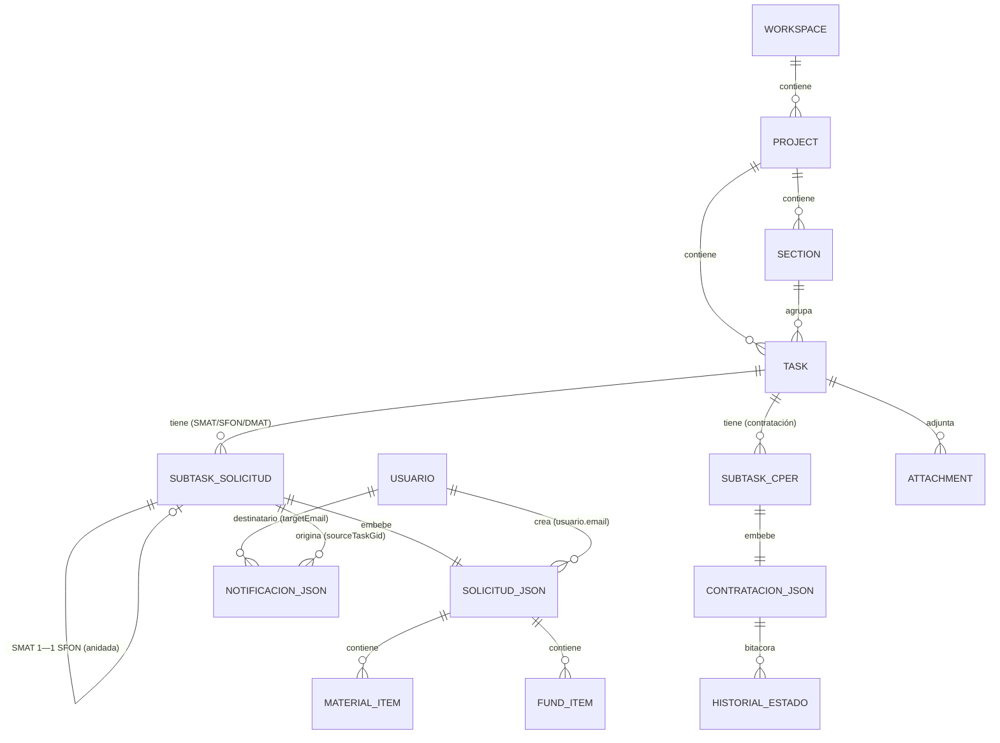
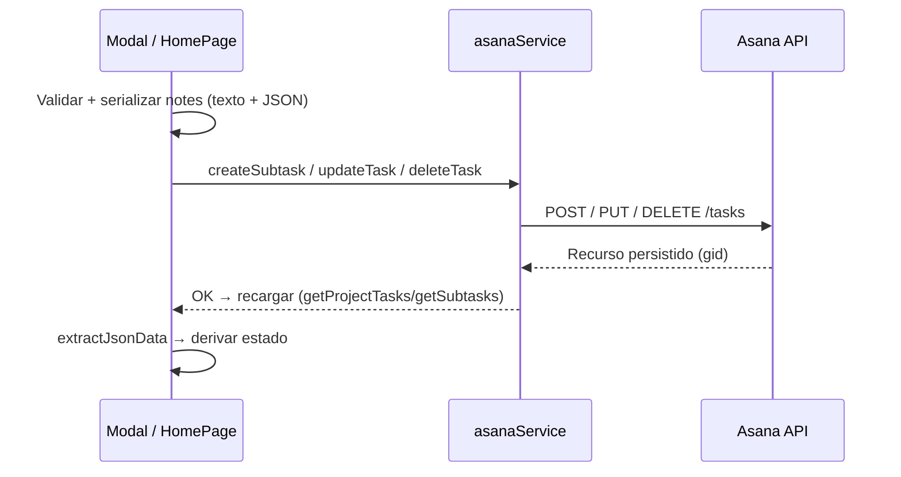

# Especificación — Modelo de Datos

> Documento de **ingeniería inversa**. Describe el modelo de datos **real** del proyecto CDIMA tal como existe en el código. **No propone un esquema nuevo.**

## Aviso fundamental: no existe base de datos relacional

El proyecto **no tiene backend ni base de datos** (SQL/NoSQL) propios. La **única fuente de persistencia** es el **API REST de Asana**. Por lo tanto:

- No hay tablas, ni claves primarias/foráneas ni índices en el sentido de un RDBMS.
- Las "entidades" son **recursos de Asana** (workspace, project, section, task, subtask, custom field, attachment) más **objetos JSON embebidos** en el campo `notes` de las tareas.
- Los usuarios **no** viven en Asana: están **hardcodeados** en el código ([src/context/AuthContext.tsx](../src/context/AuthContext.tsx)).

Este documento traduce ese modelo a los conceptos solicitados (tablas, PK, FK, índices, restricciones) **como equivalencias lógicas**, dejando claro dónde son reales y dónde son convenciones de la aplicación.

---

## 1. Entidades

### 1.1 Entidades nativas de Asana (recursos)

| Entidad | Descripción | Referencia de tipo |
|---|---|---|
| **Workspace** | Espacio de trabajo. Fijo: `CDIMA` | `AsanaWorkspace` |
| **Project** | Proyecto operativo (área/programa) | `AsanaProject` |
| **Section** | Sección dentro de un proyecto | `AsanaSection` |
| **Task (Actividad)** | Tarea de primer nivel = actividad | `AsanaTask` |
| **Subtask (Solicitud/Contratación)** | Subtarea = solicitud (SMAT/SFON/DMAT) o contratación (CPER) | `AsanaTask` (con `parent`) |
| **CustomField** | Campo personalizado (Estado, Area, Tipo de Solicitud, etc.) | `CustomField` |
| **Attachment** | Adjunto de tarea (biblioteca de recursos) | `AsanaAttachment` |
| **User (Asana)** | Asignado/participante | `AsanaUser` |

Definiciones en [src/types/asana.types.ts](../src/types/asana.types.ts).

### 1.2 Entidades lógicas embebidas (JSON en `Task.notes`)

Delimitadas por `===DATOS_JSON=== ... ===FIN_DATOS_JSON===` y parseadas por `extractJsonData()`.

| Entidad lógica | Se almacena en | Tipo/estructura |
|---|---|---|
| **Solicitud** (base) | `notes` de la subtarea SMAT/SFON/DMAT | JSON |
| **MaterialItem** | `Solicitud.materiales[]` | `{ id, detalle, cantidad, unidad, observaciones, almacen? }` |
| **FundItem** | `Solicitud.fondos[]` | `{ id, descripcion, importeBolivianos }` |
| **Contratación (CPER)** | `notes` de la subtarea CPER | `ContratacionJsonData` |
| **HistorialEstado** | `Contratacion.historialEstados[]` | `{ estado, fecha, observaciones, archivos[], usuario? }` |
| **Notificación** | `notes` de tarea en proyecto `NOTIFICACIONES` | `NotificationJsonData` |
| **Adjunto de informe** | `Solicitud.informe` / `informe_final` | `{ nombre, url }` |

### 1.3 Entidad fuera de Asana

| Entidad | Almacenamiento | Estructura |
|---|---|---|
| **Usuario (app)** | Array `USERS` hardcodeado + env | `{ email, password, role, name, solicitante?, cargo? }` |

---

## 2. "Tablas" (mapeo lógico)

> Nomenclatura de tabla usada solo como equivalencia; en realidad son colecciones de recursos Asana / arreglos JSON.

### T1 · `workspace`
| Columna | Tipo | Notas |
|---|---|---|
| `gid` 🔑 | string | PK (Asana) |
| `name` | string | `= 'CDIMA'` (constante de búsqueda) |

### T2 · `project`
| Columna | Tipo | Notas |
|---|---|---|
| `gid` 🔑 | string | PK |
| `workspace_gid` 🔗 | string | FK → `workspace.gid` |
| `name` | string | Convención de exclusión (`*CDIMA*`, `NOTIFICACIONES`, `Administración`) |
| `notes`, `color` | string | Metadatos |

### T3 · `section`
| Columna | Tipo | Notas |
|---|---|---|
| `gid` 🔑 | string | PK |
| `project_gid` 🔗 | string | FK → `project.gid` |
| `name` | string | Se ignora `'Sección sin nombre'` |

### T4 · `task` (actividad de primer nivel)
| Columna | Tipo | Notas |
|---|---|---|
| `gid` 🔑 | string | PK |
| `parent_gid` 🔗 | string \| null | FK → `task.gid` (null = primer nivel) |
| `project_gid` 🔗 | string | FK → `project.gid` (vía `projects[]`/`memberships[]`) |
| `section_gid` 🔗 | string | FK → `section.gid` (vía `memberships[0].section`) |
| `name` | string | Prefijos/convención (`Resumen:`, `FUENTES DE VERIFICACION`) |
| `completed` | bool | Fallback de "ejecutado" |
| `due_on`, `start_on` | date | Cálculo de atrasadas/próximas |
| `num_subtasks` | number | ¿tiene subtareas? |
| `cf.Estado` | enum | `EJECUTADO` / `En Proceso` (estado real) |
| `cf.Area` | enum | Restricción por rol técnico |
| `cf.Responsables de actividad` | people/enum | Distribución |

### T5 · `subtask_solicitud` (SMAT/SFON/DMAT)
| Columna | Tipo | Notas |
|---|---|---|
| `gid` 🔑 | string | PK |
| `parent_gid` 🔗 | string | FK → `task.gid` **o** `subtask_solicitud.gid` (SFON anidada bajo SMAT) |
| `name` | string | `"{PREFIJO} - {titulo}"` |
| `cf.Tipo de Solicitud` | enum | `Solicitud de Material`… |
| `completed` | bool | `true` al crear / aprobar |
| `due_on` | date | `= fechaFinalizacion` |
| `notes.json` | JSON | Entidad **Solicitud** (T6) |

### T6 · `solicitud_json` (embebida en T5.notes)
| Columna | Tipo | Restricción |
|---|---|---|
| `tipo` | string | enum de negocio |
| `titulo` | string | forma el `name` de la subtarea |
| `area`, `lugar` | string | **NOT NULL** (validado) |
| `fechaInicio`, `fechaFinalizacion` | `DD/MM/YYYY` | fin ≥ inicio |
| `fechaSolicitud` | string | timestamp La Paz |
| `fechaAprobacion` | string | presente ⇒ **estado=Aprobada** |
| `observado`, `motivoObservacion`, `fechaObservacion` | bool/string | presentes ⇒ **estado=Observada** |
| `archivado` | bool | `true` ⇒ **estado=Archivada** (solo válido en solicitud Aprobada con ciclo SMAT↔SFON aprobado); ausente ⇒ no archivada |
| `fechaArchivado` | string | timestamp La Paz del archivado (`DD/MM/YYYY, HH:mm`); presente si `archivado === true` |
| `usuario` 🔗 | `{ nombre, email, rol }` | FK lógica → `usuario.email` |
| `solicitante`, `cargo` | string | datos de PDF |
| `materiales[]` | MaterialItem | SMAT/DMAT |
| `fondos[]`, `totalBolivianos` | FundItem/number | SFON |
| `informe`, `informe_final` | `{ nombre, url }` | URL `http(s)://` |

### T7 · `material_item` (embebida en T6.materiales[])
| Columna | Tipo | Notas |
|---|---|---|
| `id` 🔑* | number | PK **local** al arreglo (`max(id)+1`) |
| `detalle` | string | **NOT NULL** (≥1 requerido) |
| `cantidad`, `unidad`, `observaciones` | string | default `'-'` |
| `almacen` | enum | `ENTREGADO` / `NO AUTORIZADO` / `NO EXISTENTE` |

### T8 · `fund_item` (embebida en T6.fondos[])
| Columna | Tipo | Notas |
|---|---|---|
| `id` 🔑* | number | PK local |
| `descripcion` | string | **NOT NULL** |
| `importeBolivianos` | string(number) | monto |

### T9 · `contratacion_json` (CPER, embebida en subtarea)
| Columna | Tipo | Notas |
|---|---|---|
| `tipo`, `actividad`, `subarea` | string | metadatos |
| `descripcion` | string \| null | |
| `fechaGeneracion` | string | |
| `estadoActual` | enum | 5 estados fijos (ver §6) |
| `historialEstados[]` | HistorialEstado | bitácora append-only |

### T10 · `historial_estado` (embebida en T9)
| Columna | Tipo | Notas |
|---|---|---|
| `estado` | enum | |
| `fecha` | string | La Paz |
| `observaciones` | string | |
| `archivos[]` | `{ nombre, link }` | |
| `usuario` 🔗 | `{ nombre, email }` | FK lógica → `usuario.email` |

### T11 · `notificacion_json` (proyecto NOTIFICACIONES)
| Columna | Tipo | Notas |
|---|---|---|
| `gid` 🔑 | string | PK = gid de la tarea |
| `type` | enum | `solicitud_creada`/`aprobada`/`observada` |
| `title`, `description` | string | descripción jerárquica |
| `createdAt` | ISO date | orden y purga (30 días) |
| `sourceTaskGid` 🔗 | string | FK → `subtask_solicitud.gid` |
| `targetEmail` 🔗 | string | FK lógica → `usuario.email` |
| `read` | bool | = `task.completed` |

### T12 · `usuario` (hardcodeado, fuera de Asana)
| Columna | Tipo | Notas |
|---|---|---|
| `email` 🔑 | string | PK lógica; usado en filtros/FK |
| `password` | string | desde env (⚠ ver limitaciones) |
| `role` | enum | 6 roles |
| `name` | string | |
| `solicitante`, `cargo` | string? | para PDFs |

> 🔑 = PK real (Asana `gid`) · 🔑* = PK local al arreglo JSON · 🔗 = FK lógica

---

## 3. Relaciones

**Cardinalidades clave**

- Workspace 1 — N Project — N Section/Task.
- Task (actividad) 1 — N Subtask (solicitudes/contrataciones).
- **SMAT 1 — 1 SFON** (regla de negocio; una SFON anidada por SMAT aprobada).
- Solicitud 1 — N MaterialItem / FundItem.
- Contratación 1 — N HistorialEstado (append-only).
- Usuario 1 — N Solicitud (autoría) / N Notificación (destino).

---

## 4. Llaves primarias

| Tabla | PK | Naturaleza |
|---|---|---|
| workspace, project, section, task, subtask_*, notificacion | `gid` | **Real**, generada por Asana (global, inmutable) |
| material_item, fund_item | `id` | **Local** al arreglo JSON: `Math.max(...ids, 0) + 1` |
| usuario | `email` | **Lógica** (no declarada; usada como identificador único) |
| historial_estado | — | Sin PK; identificado por posición/fecha en el arreglo |

---

## 5. Llaves foráneas

| Origen | Columna FK | Destino | Implementación |
|---|---|---|---|
| project | `workspace.gid` | workspace | Query `?workspace={gid}` |
| section | `project.gid` | project | Endpoint anidado |
| task/subtask | `parent.gid` | task/subtask | Campo `parent` de Asana |
| task | `memberships[].project/section` | project/section | `memberships` / `projects[]` |
| solicitud_json | `usuario.email` | usuario | Comparación de strings (case-sensitive en filtros, salvo notificaciones) |
| notificacion | `sourceTaskGid` | subtask_solicitud | String gid en JSON |
| notificacion | `targetEmail` | usuario | Comparación **case-insensitive** |
| historial_estado | `usuario.email` | usuario | String en JSON |

> Ninguna FK tiene integridad referencial forzada: son referencias por convención, no restricciones de un motor de datos.

---

## 6. Índices relevantes

No hay índices de base de datos. Los "índices" que usa la app son:

1. **Indexación implícita de Asana** por `gid` en cada endpoint (`GET /tasks/{gid}`, etc.).
2. **`opt_fields`** en las consultas: actúan como *covering projections* para traer solo los campos necesarios y reducir payload (ej. `getProjectTasks`, `getProjectTasksForCalendar`).
3. **Estructuras en memoria** construidas por request (índices efímeros):
   - `workspacesCache` — caché de workspaces (evita relecturas).
   - `notificationsService.wsGid/projectGid` — caché de contexto de notificaciones.
   - `atrasadasMap: Map<taskGid, idx>` — lookup de actividades atrasadas ([HomePage.tsx](../src/pages/HomePage.tsx)).
   - `smatConSfon: Set<parentTaskGid>` — índice de SMAT que ya tienen SFON.
4. **Enumeraciones de campos personalizados** resueltas por nombre (ej. `Tipo de Solicitud` → `enum_options[].name`).

---

## 7. Restricciones

### 7.1 Validación (nivel formulario)
- `area`, `lugar`, `fechaInicio`, `fechaFinalizacion` **obligatorios**.
- `fechaFinalizacion ≥ fechaInicio`.
- Al menos **1** `material` con `detalle` (SMAT/DMAT) / al menos 1 `fondo` con `descripcion` (SFON).
- `informe.url` / `informe_final.url` deben ser `http(s)://`.

### 7.2 Convenciones estructurales (equivalentes a constraints)
- **Prefijo del nombre** define el tipo: `SMAT` / `SFON` / `DMAT` / `CPER`.
- Nombre de subtarea = `"{PREFIJO} - {titulo}"`.
- Bloque JSON delimitado por `===DATOS_JSON=== / ===FIN_DATOS_JSON===` (obligatorio para el modelo nuevo; hay **fallback de texto** para registros antiguos).
- **UNIQUE lógico**: SMAT ↔ SFON 1:1 (asumida por la UI, no forzada).
- **Enum cerrado** de estados de contratación (5 valores): `Requerimiento de contratación`, `Elaboración de TDRs`, `Lanzamiento de convocatoria`, `Selección del consultor`, `Informe final del consultor`.
- **Enum cerrado** de estado de almacén: `ENTREGADO`, `NO AUTORIZADO`, `NO EXISTENTE`.
- **Estado de actividad**: `EJECUTADO` (campo `Estado`) o fallback `completed`.
- Exclusiones: proyectos `*CDIMA*`/`NOTIFICACIONES`; tareas `Resumen:`/`FUENTES DE VERIFICACION`; proyecto `Administración` fuera de stats/atrasadas.

### 7.3 Restricciones de acceso (a nivel dato)
- Rol técnico ev/ep: solo datos cuyo `Area` (tarea `Resumen:`) coincide.
- Rol `comunicacion`: solo solicitudes con `usuario.email == user.email`.
- Notificaciones: cada usuario solo ve `targetEmail == user.email`.

---

## 8. Flujo de persistencia

### 8.1 Crear (solicitud)
1. Validación en el modal.
2. Construcción de `notes` = texto legible + bloque JSON.
3. `createSubtask(parent, workspace, { name, notes, due_on, completed:true, custom_fields })` → `POST /tasks`.
4. (Opcional) Notificación a aprobadores.

### 8.2 Leer
- `getWorkspaces` → `getProjects` → `getProjectTasks` → `getSubtasks` (recursivo para SFON anidadas).
- Parseo con `extractJsonData()`; derivación de estado (pendiente/aprobada/observada) desde el JSON.

### 8.3 Actualizar (aprobar/observar/almacén/informe/contratación)
- Se **re-serializa** el JSON completo con los nuevos campos y se hace `updateTask(gid, { notes, completed?, custom_fields? })` → `PUT /tasks/{gid}`.
- Contratación: se **append** un `HistorialEstado` y se actualiza `estadoActual`.

### 8.4 Eliminar
- `deleteTask(gid)` → `DELETE /tasks/{gid}` (según permisos; ver spec de permisos).
- Notificaciones: purga automática de leídas > 30 días durante `list()`.

---

## 9. Limitaciones del modelo de datos

- **L-1 Sin motor de datos**: no hay transacciones, integridad referencial, ni constraints reales; todo es convención de la app.
- **L-2 JSON en texto libre**: una edición manual en Asana puede corromper el bloque `===DATOS_JSON===`.
- **L-3 PK locales frágiles**: `id` de items se reasigna por arreglo; no es estable entre ediciones.
- **L-4 FK no forzadas**: `usuario.email`, `sourceTaskGid`, `targetEmail` pueden quedar colgadas (huérfanas) sin detección.
- **L-5 Relación 1:1 SMAT↔SFON** no garantizada por Asana.
- **L-6 Usuarios fuera del modelo** y con credenciales en el cliente (env `VITE_`).
- **L-7 Consistencia por convención de nombres** (prefijos y nombres de campos personalizados).

---

### Referencias de código
- Tipos Asana: [src/types/asana.types.ts](../src/types/asana.types.ts)
- Tipos notificación: [src/types/notification.types.ts](../src/types/notification.types.ts)
- Acceso a datos: [src/services/asana.service.ts](../src/services/asana.service.ts)
- Persistencia de solicitudes: [src/components/MaterialRequestModal.tsx](../src/components/MaterialRequestModal.tsx), [src/components/FundsRequestModal.tsx](../src/components/FundsRequestModal.tsx), [src/components/MaterialReturnModal.tsx](../src/components/MaterialReturnModal.tsx)
- Contrataciones: [src/components/ContratacionUpdateModal.tsx](../src/components/ContratacionUpdateModal.tsx)
- Notificaciones: [src/services/notifications.service.ts](../src/services/notifications.service.ts)
- Usuarios/roles: [src/context/AuthContext.tsx](../src/context/AuthContext.tsx), [src/context/permissions.ts](../src/context/permissions.ts)
- Campos personalizados: [src/constants/asana-fields.ts](../src/constants/asana-fields.ts)
</content>
