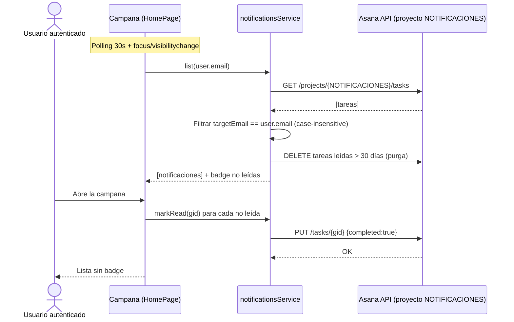
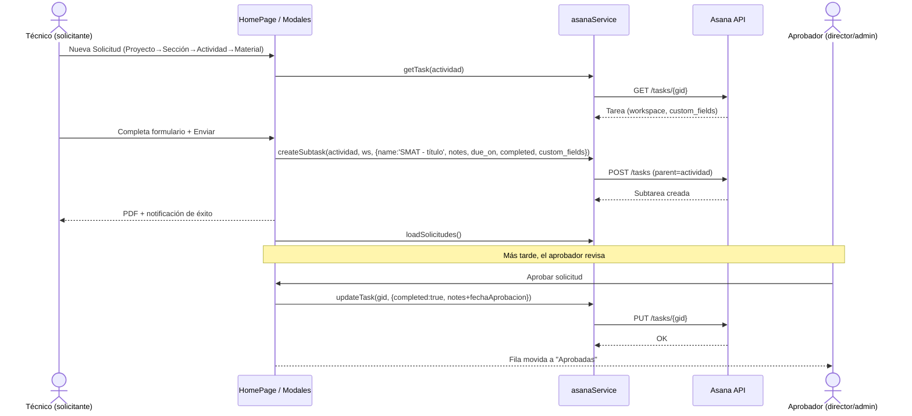
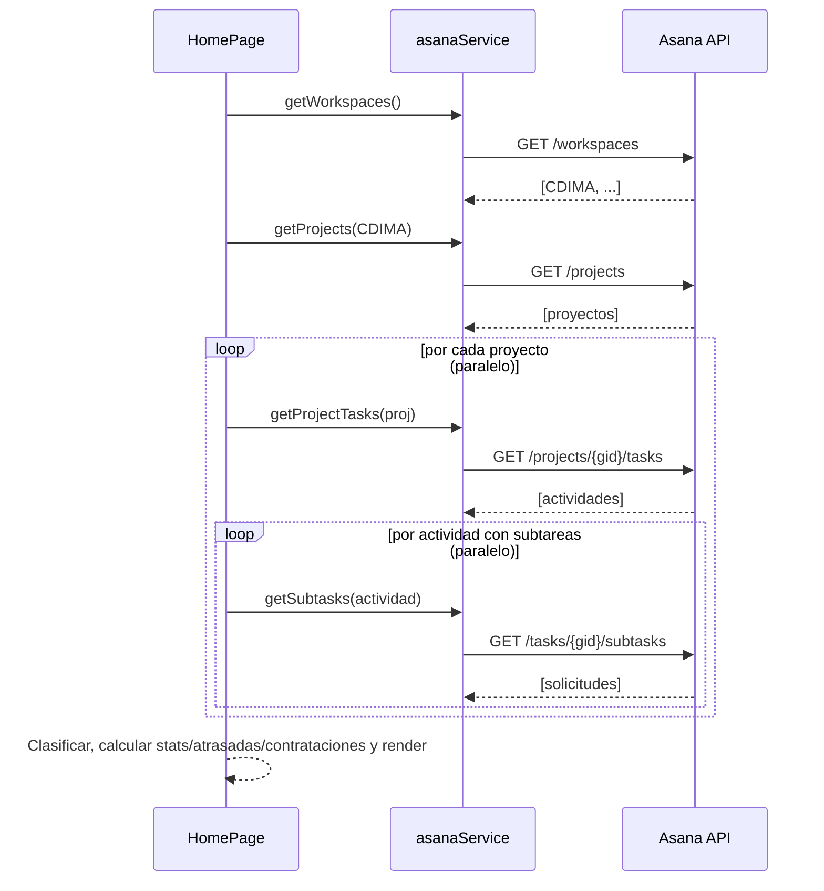

# Especificación — Seguimiento de Proyecto y Solicitud de Materiales

> Documento de **ingeniería inversa** generado a partir del código existente. No define funcionalidad nueva; describe el comportamiento actual del sistema CDIMA, construido sobre el API de Asana.

---

## 1. Objetivo de la funcionalidad

Proveer una capa de gestión (dashboard operativo) sobre Asana que permita:

1. **Seguimiento de proyectos**: visualizar el avance de actividades por proyecto, actividades atrasadas, contrataciones en curso e indicadores globales (KPIs), calculando el estado a partir de tareas, subtareas y campos personalizados de Asana.
2. **Solicitud de materiales (y fondos/devoluciones)**: crear, aprobar, observar, duplicar e imprimir solicitudes que se **persisten como subtareas de Asana**, sin base de datos propia.

El sistema **amplía** Asana usando sus tareas como almacén de datos estructurados (JSON embebido en el campo `notes`) y sus campos personalizados como máquina de estados.

---

## 2. Descripción general

- **Frontend SPA**: React + TypeScript + Vite. UI con Ant Design.
- **Backend**: **no existe backend ni base de datos propios**. La única fuente de datos es el **API REST de Asana** (`https://app.asana.com/api/1.0`), consumido directamente desde el navegador con un Personal Access Token (`VITE_ASANA_TOKEN`).
- **Workspace fijo**: `CDIMA`. Se descubre por nombre en cada carga.
- **Modelo de datos**: cada solicitud es una **subtarea** de Asana cuyo `notes` contiene texto legible y un bloque JSON delimitado por `===DATOS_JSON=== ... ===FIN_DATOS_JSON===`, parseado por `extractJsonData()`.
- **Página principal**: [src/pages/HomePage.tsx](../src/pages/HomePage.tsx) concentra el seguimiento y la gestión de solicitudes.
- **Acceso a datos**: [src/services/asana.service.ts](../src/services/asana.service.ts) (singleton `asanaService`).
- **Autenticación**: usuarios **hardcodeados** en [src/context/AuthContext.tsx](../src/context/AuthContext.tsx); contraseñas provistas por variables de entorno.

---

## 3. Requisitos funcionales

### 3.1 Solicitudes (materiales / fondos / devoluciones)

- **RF-01** El sistema identifica solicitudes por prefijo del nombre de la subtarea:
  - `SMAT` → Solicitud de Material
  - `SFON` → Solicitud de Fondos
  - `DMAT` → Devolución de Material
  - (`CPER` → Contratación de personal/consultoría; tratada aparte)
- **RF-02** Crear una solicitud de material genera una subtarea `SMAT - {título}` bajo la actividad (tarea) seleccionada, con `notes` (texto + JSON), `due_on = fechaFinalización`, `completed = true` y el campo personalizado **"Tipo de Solicitud" = "Solicitud de Material"** cuando el proyecto lo define.
- **RF-03** El alta de solicitud se realiza eligiendo **Proyecto → Sección → Actividad → Tipo** ([src/components/NuevaSolicitudModal.tsx](../src/components/NuevaSolicitudModal.tsx)), y luego completando el formulario específico (material/fondos/devolución).
- **RF-04** Al crear una solicitud se **genera automáticamente un PDF** (`pdf.service`) y se muestra notificación de éxito.
- **RF-05** Las solicitudes se listan en tres pestañas: **Pendientes**, **Aprobadas**, **Observadas**, con búsqueda por actividad, proyecto, tipo, fecha y solicitante.
- **RF-06** **Aprobar** una solicitud marca la subtarea `completed = true` y agrega `fechaAprobacion` al JSON. Solo roles aprobadores (director/administrador).
- **RF-07** **Observar** una solicitud agrega `observado`, `motivoObservacion` y `fechaObservacion` al JSON (sin completar la tarea). Solo roles aprobadores.
- **RF-08** **Duplicar** una solicitud observada abre el formulario con datos prellenados para recrearla.
- **RF-09** Desde una **SMAT aprobada** se puede crear una **SFON anidada** (subtarea de la SMAT), con datos heredados (título, área, lugar, fechas, ítems). Relación 1 SMAT → 1 SFON.
- **RF-10** Se puede **eliminar** una solicitud (`deleteTask`). El rol `comunicación` solo puede eliminar solicitudes propias; técnicos (no comunicación), director y administrador pueden eliminar pendientes.
- **RF-11** Se pueden adjuntar enlaces de **Planificación** (`informe`) e **Informe final** (`informe_final`) al JSON de la solicitud, con validación de URL (`http(s)://`).
- **RF-12** En solicitudes de material aprobadas se puede fijar el **estado de almacén** por ítem (`ENTREGADO`, `NO AUTORIZADO`, `NO EXISTENTE`), persistido en `materiales[].almacen`.

### 3.2 Seguimiento de proyecto

- **RF-13** Por cada proyecto (excluyendo los que contienen `CDIMA` y el proyecto `NOTIFICACIONES`) se calculan estadísticas: total de actividades de primer nivel, ejecutadas, atrasadas, próximas a vencer (≤ 7 días) y solicitudes pendientes.
- **RF-14** Una actividad se considera **ejecutada** si su campo personalizado **"Estado" = "EJECUTADO"** (fallback: `task.completed`).
- **RF-15** **Actividades atrasadas**: tareas de primer nivel con `due_on < hoy` no ejecutadas, con sus sub-actividades y porcentaje de ejecución. Excluye el proyecto **Administración** y no aplica a técnicos.
- **RF-16** **Contrataciones activas**: subtareas con prefijo `CPER` no completadas / no ejecutadas, con seguimiento de pasos e historial de estados ([src/components/ContratacionUpdateModal.tsx](../src/components/ContratacionUpdateModal.tsx)).
- **RF-17** **KPIs globales**: número de proyectos, avance global (%), vencidas y solicitudes pendientes.
- **RF-18** Filtrado por rol:
  - **Técnicos** (`tecnico ev`/`tecnico ep`): solo ven proyectos de su **área** (determinada por el campo `Area` de la tarea `Resumen:` del proyecto); no ven KPIs, atrasadas ni contrataciones.
  - **Comunicación**: solo ve **sus propias** solicitudes.
  - **Director/Administrador**: acceso completo.

### 3.3 Notificaciones (módulo opcional, desactivado por defecto)

- **RF-19** Detrás de la bandera `VITE_NOTIFICACIONES_ENABLED` (`false` por defecto) se generan notificaciones como tareas del proyecto Asana `NOTIFICACIONES`, una por destinatario, para eventos `solicitud_creada` (→ aprobadores), `solicitud_aprobada` y `solicitud_observada` (→ solicitante). Ver [src/services/notifications.service.ts](../src/services/notifications.service.ts).

---

## 4. Requisitos no funcionales

- **RNF-01 Rendimiento/concurrencia**: control de concurrencia mediante `Semaphore` (30 lecturas, 12 escrituras simultáneas) para respetar límites de Asana. Los proyectos y subtareas se procesan en paralelo (`Promise.all`).
- **RNF-02 Resiliencia a rate limit**: ante HTTP 429 se reintenta usando `Retry-After` o backoff exponencial (máx. 3 reintentos) en `fetchAsana()`.
- **RNF-03 Tolerancia a fallos**: errores de proyectos/subtareas individuales se ignoran (try/catch locales) para no romper la carga global.
- **RNF-04 Caché**: los workspaces se cachean en memoria (`workspacesCache`) para evitar llamadas repetidas.
- **RNF-05 Seguridad (limitación actual)**: el token de Asana y las contraseñas viven en variables de entorno expuestas al cliente (`VITE_`); la autenticación es local y hardcodeada (ver Limitaciones).
- **RNF-06 UX**: refresco manual ("Actualizar"), estados de carga (Spin), y refresco automático/al enfocar solo para el módulo de notificaciones.
- **RNF-07 Zona horaria**: las fechas de solicitud/aprobación/observación se formatean en `America/La_Paz` (`es-ES`).
- **RNF-08 Compatibilidad de datos**: los parsers soportan formato JSON nuevo y **fallback de texto libre** (solicitudes antiguas).

---

## 5. Reglas de negocio

- **RN-01** Estado de una solicitud (derivado del JSON en `notes`):
  - **Pendiente**: sin `fechaAprobacion` y sin (`motivoObservacion` + `fechaObservacion`).
  - **Aprobada**: `fechaAprobacion` presente (tarea `completed = true`).
  - **Observada**: `motivoObservacion` y `fechaObservacion` presentes.
- **RN-02** Una **SMAT** puede tener **como máximo una SFON** asociada (relación 1 a 1).
- **RN-03** Las SFON anidadas se muestran inmediatamente después de su SMAT en la pestaña Aprobadas; una SMAT y su SFON cuentan como **un solo registro**.
- **RN-04** **Aprobadores** = usuarios con rol `director` o `administrador` (`getAprobadorEmails()`).
- **RN-05** "Ejecutado" prioriza el campo personalizado `Estado = EJECUTADO`; si no existe, usa `completed`.
- **RN-06** Se **excluyen** de listados/estadísticas las tareas cuyo nombre inicia con `Resumen:`, `FUENTES DE VERIFICACION`, y los prefijos de solicitud al listar actividades base.
- **RN-07** Se **excluyen** del seguimiento los proyectos cuyo nombre contiene `CDIMA` y el proyecto `NOTIFICACIONES`.
- **RN-08** El proyecto **Administración** se excluye del cálculo de atrasadas y de estadísticas de avance.
- **RN-09** Los **técnicos** solo operan sobre proyectos de su área (campo `Area` de la tarea `Resumen:`); `comunicación` solo ve sus propias solicitudes (filtrado por `usuario.email`).
- **RN-10** El **título** de la solicitud (`titulo`) forma el nombre de la subtarea: `SMAT - {titulo}` / `SFON - {titulo}` / etc.
- **RN-11** Validaciones de creación: área, lugar, fecha inicio y fin obligatorios; fin ≥ inicio; al menos un ítem con detalle.

---

## 5.bis Permisos por rol

> Fuente de verdad: `ROLE_PERMISSIONS`, `ROLE_PAGES` y `ROLE_ESCUELA_AREA` en [src/context/permissions.ts](../src/context/permissions.ts), complementados por comprobaciones directas en [src/pages/HomePage.tsx](../src/pages/HomePage.tsx).

### 5.bis.1 Matriz de acciones (Home + Reportes/Solicitudes)

| Acción (permiso) | director | administrador | tecnico ev | tecnico ep | comunicacion | planificador |
|---|:--:|:--:|:--:|:--:|:--:|:--:|
| Ver detalle (`home.solicitud.ver_detalle`) | ✅ | ✅ | ✅ | ✅ | ✅ | ❌ |
| Aprobar (`*.solicitud.aprobar`) | ✅ | ✅ | ❌ | ❌ | ❌ | ❌ |
| Observar (`*.solicitud.observar`) | ✅ | ✅ | ❌ | ❌ | ❌ | ❌ |
| Crear (`reporte.solicitud.crear`) | ✅ | ✅ | ✅ | ✅ | ✅ | ❌ |
| Eliminar (`reporte.solicitud.eliminar`) | ✅ | ✅ | ❌ | ❌ | ❌ | ❌ |
| Cambiar estado subactividad | ✅ | ✅ | ✅ | ✅ | ✅ | ❌ |
| Beneficiarios | ✅ | ✅ | ✅ | ✅ | ✅ | ❌ |
| Agregar fuentes de verificación | ✅ | ✅ | ✅ | ✅ | ✅ | ❌ |
| Actualizar estado contratación (CPER) | ✅ | ✅ | ✅ | ✅ | ✅ | ❌ |
| Exportar reportes | ✅ | ✅ | ✅ | ✅ | ✅ | ✅ |

### 5.bis.2 Reglas de permisos y visibilidad

- **RN-P1 Aprobar/Observar**: controlado por `canApprove = role === 'administrador' || 'director'` (`HomePage`); los botones se deshabilitan con tooltip "Sin permiso para observar".
- **RN-P2 Filtro por rol técnico**: `isTecnico` agrupa `tecnico ev`, `tecnico ep` **y** `comunicacion` para ocultar KPIs, atrasadas y contrataciones.
- **RN-P3 Restricción de área**: `tecnico ev` → "Erradicación de Violencia", `tecnico ep` → "Empoderamiento Político"; solo ven proyectos cuyo campo `Area` (tarea `Resumen:`) coincide.
- **RN-P4 Propiedad (comunicación)**: `comunicacion` solo ve **sus propias** solicitudes (filtrado por `usuario.email`).
- **RN-P5 Planificador**: prácticamente excluido del feature de solicitudes (solo `reporte.exportar`; sin acceso a `/` ni `/report` según `ROLE_PAGES`).
- **RN-P6 Páginas accesibles**: definidas en `ROLE_PAGES`; navegación restringida en [src/components/Layout.tsx](../src/components/Layout.tsx).
- **RN-P7 Aprobadores para notificaciones**: `getAprobadorEmails()` = usuarios `director` + `administrador`.

### 5.bis.3 Inconsistencia de borrado (deuda técnica)

Existen **tres criterios distintos** de borrado que conviven:

1. Permiso formal `reporte.solicitud.eliminar` → `director` + `administrador`.
2. Pendientes en `HomePage`: `canDelPending = director || administrador || (isTecnico && !comunicacion) || isOwner` (permite técnicos y al propietario).
3. Otra vista de `HomePage`: `disabled = role !== 'director'` ("Solo el director puede eliminar").

Estos criterios **no coinciden entre sí** (ver LIM-11).

---

## 5.ter Reportes generados

> Ámbito: reportes de **seguimiento de proyecto** y **solicitudes**. Los reportes de Escuelas/Diplomados/Alto Nivel existen en el mismo módulo pero pertenecen a otros dominios.

### 5.ter.1 Tecnologías

- **PDF**: `jsPDF` + `jspdf-autotable` (paleta y estilo “ejecutivo CDIMA”, logo institucional). Ver [src/services/pdf.service.ts](../src/services/pdf.service.ts).
- **Word**: `docx` (`Document`/`Packer`/`Table`). Ver [src/services/reports/report-word.service.ts](../src/services/reports/report-word.service.ts).
- **CSV**: `ExportService` genera CSV **compatible con la importación de Asana** (escape de comillas/comas, fechas `YYYY-MM-DD`). Ver [src/services/export.service.ts](../src/services/export.service.ts).
- **Fuente de datos**: los reportes se construyen a partir del **mismo JSON en `notes`** y de los campos personalizados de Asana; no hay capa de datos separada.

### 5.ter.2 Catálogo de reportes

| Reporte | Formato | Disparador | Servicio |
|---|---|---|---|
| Solicitud de material (SMAT) | PDF | Automático al crear | `exportMaterialRequestToPDF` |
| Solicitud de fondos (SFON) | PDF | Automático al crear | `exportFundsRequestToPDF` |
| Devolución de material (DMAT) | PDF | Automático al crear | `exportMaterialReturnToPDF` |
| Reporte de actividad | PDF / Word | Bajo demanda | `exportTaskReportToPDF` / `exportTaskReportToWord` |
| Ficha de actividad | PDF / Word | Bajo demanda | `exportFichaActividadToPDF` / `exportFichaActividadToWord` |
| Beneficiarios | PDF / Word | Bajo demanda | `exportBeneficiariesToPDF` / `exportBeneficiariesToWord` |
| Distribución de responsables | PDF / Word | Bajo demanda | `exportDistributionToPDF` / `exportDistributionReportToWord` |
| Cronograma (Gantt) | PDF / Word | Bajo demanda | `exportGanttToPDF` / `exportGanttToWord` |
| Planificación | PDF / Word | Bajo demanda | [planning-reports.service.ts](../src/services/reports/planning-reports.service.ts) |
| Exportación de proyecto | CSV | Bajo demanda | `ExportService` |

### 5.ter.3 Reglas de reportes

- **RN-R1** Los PDF de solicitud se generan **automáticamente** tras crear la subtarea (`setTimeout` ~500 ms), antes de cerrar el modal.
- **RN-R2** El permiso `reporte.exportar` lo poseen **todos los roles** (incluido `planificador`), a diferencia de crear/aprobar/eliminar.
- **RN-R3** Casi todos los reportes ofrecen **doble formato** PDF y Word; el CSV es exclusivo de la exportación de proyecto compatible con Asana.
- **RN-R4** El estado se colorea según `Estado` (Ejecutado = verde, En Proceso = azul), coherente con RN-05.

---

## 5.quater Notificaciones (módulo opcional)

> **Estado**: desactivado por defecto (`VITE_NOTIFICACIONES_ENABLED` = `false`). Con la bandera apagada, **todos los métodos son no-op**, no hacen llamadas al API y la app se comporta igual que sin el módulo. Nunca lanzan excepciones. Fuente: [src/services/notifications.service.ts](../src/services/notifications.service.ts) y la campana en [src/pages/HomePage.tsx](../src/pages/HomePage.tsx).

### 5.quater.1 Modelo

- Cada notificación es **una tarea de Asana por destinatario** dentro del proyecto `NOTIFICACIONES` (mismo workspace `CDIMA`).
- Datos embebidos en `notes` como JSON (`===DATOS_JSON===`): `{ type, title, description, createdAt (ISO), sourceTaskGid, targetEmail }`.
- **"Leída" = tarea `completed`**.
- Tipos (`NotificationType`): `solicitud_creada`, `solicitud_aprobada`, `solicitud_observada`.

### 5.quater.2 Eventos y destinatarios

| Evento | Se dispara cuando… | Destinatarios |
|---|---|---|
| `solicitud_creada` | Se crea una solicitud (SMAT/SFON/DMAT) por cualquier vía | **Aprobadores** (`getAprobadorEmails()` = director + administrador) |
| `solicitud_aprobada` | Un aprobador aprueba una solicitud | **Solicitante** (`usuario.email` del JSON de la solicitud) |
| `solicitud_observada` | Un aprobador observa una solicitud | **Solicitante** (`usuario.email`) |

- La descripción usa la **jerarquía** `Proyecto › Sección › Tarea › Subtarea`.
- `notify()` hace **fan-out**: crea una tarea por destinatario (deduplicando emails).

### 5.quater.3 Permisos y visibilidad

- **RN-N1 Sin control por rol formal**: no hay permisos en `permissions.ts` para notificaciones; el acceso está gobernado únicamente por (a) la **bandera** y (b) la **coincidencia de email**.
- **RN-N2 Visibilidad por destinatario**: `list(email)` devuelve **solo** las notificaciones cuyo `targetEmail` coincide con el email del usuario autenticado (comparación **case-insensitive**). Ningún usuario ve las de otro.
- **RN-N3 Recepción según rol de negocio**: en la práctica, `solicitud_creada` la reciben director/administrador; `aprobada`/`observada` las recibe el solicitante (técnico/comunicación que la creó).
- **RN-N4 Marcar leídas**: al abrir la campana se marcan **todas** las no leídas como leídas (`markRead` → `completed:true`). El badge muestra el conteo de no leídas.
- **RN-N5 Purga global**: cualquier `list()` purga (elimina) las notificaciones **leídas** con más de `PURGE_DAYS` (30) días — efecto colateral compartido, independiente del rol.
- **RN-N6 Refresco**: polling cada **30 s** + refresco inmediato al recuperar foco (`window focus` / `document visibilitychange`).
- **RN-N7 Aislamiento del dominio**: el proyecto `NOTIFICACIONES` se **excluye** del seguimiento y de las estadísticas (RN-07).

### 5.quater.4 Diagrama de secuencia (campana)



### 5.quater.5 Casos límite (notificaciones)

- **CL-N1** Bandera `false`: no-op total; sin llamadas al API.
- **CL-N2** Proyecto `NOTIFICACIONES` inexistente: `getContext()` retorna `null` y los métodos no hacen nada.
- **CL-N3** `usuario.email` ausente en el JSON de la solicitud: no hay destinatario para `aprobada`/`observada`.
- **CL-N4** Emails con distinta capitalización: se resuelven con comparación case-insensitive.
- **CL-N5** Errores de red: se registran en consola pero **nunca** interrumpen el flujo principal (crear/aprobar/observar).

---

## 6. APIs involucradas (Asana REST v1.0)

Todas las llamadas pasan por `fetchAsana()` con `Authorization: Bearer <token>`.

| Operación | Endpoint | Método | Uso |
|---|---|---|---|
| Listar workspaces | `/workspaces` | GET | Descubrir workspace `CDIMA` (cacheado) |
| Listar proyectos | `/projects?workspace={gid}&archived=false&opt_fields=name,notes,color` | GET | Proyectos del workspace |
| Listar secciones | `/projects/{gid}/sections` | GET | Selector de sección |
| Tareas de proyecto | `/projects/{gid}/tasks?opt_fields=...` | GET | Actividades + memberships + custom_fields |
| Tareas de sección | `/sections/{gid}/tasks?opt_fields=...` | GET | Actividades de una sección |
| Detalle de tarea | `/tasks/{gid}?opt_fields=...` | GET | Tarea completa (workspace, projects, custom_fields) |
| Subtareas | `/tasks/{gid}/subtasks?opt_fields=...` | GET | Solicitudes bajo cada actividad |
| Tarea "Resumen:" | `/projects/{gid}/tasks?opt_fields=...` | GET | Determinar área del proyecto |
| Crear tarea | `/tasks` | POST | `createTask` (notificaciones/otros) |
| Crear subtarea | `/tasks` (con `parent`) | POST | `createSubtask` (solicitud) |
| Mover a sección | `/sections/{gid}/addTask` | POST | Ubicar tarea |
| Actualizar tarea | `/tasks/{gid}?opt_fields=...` | PUT | Aprobar/observar/editar JSON, `completed` |
| Eliminar tarea | `/tasks/{gid}` | DELETE | Eliminar solicitud |
| Adjuntos | `/tasks/{gid}/attachments?opt_fields=...` | GET | Biblioteca de recursos |
| Secciones (CRUD) | `/sections/{gid}` | PUT/DELETE | Gestión de secciones |
| Plantillas | `/project_templates?...` | GET | Creación desde plantilla |

**Campos personalizados usados** (ver [src/constants/asana-fields.ts](../src/constants/asana-fields.ts)): `Estado` (EJECUTADO/En Proceso), `Area`, `Responsables de actividad`, `Tipo de Solicitud`, `Estado de contratación`, `Fecha inicio`, `Fecha fin`, `Municipio`, entre otros.

---

## 7. Entidades y "tablas" de base de datos

> **No hay base de datos.** El almacenamiento se implementa sobre entidades de Asana. Esta sección documenta el **modelo lógico equivalente**.
>
> 📘 Modelo de datos completo (entidades, tablas, PK/FK, índices, restricciones y flujo de persistencia): ver [specs/modelo-de-datos.md](./modelo-de-datos.md).

### 7.1 Jerarquía de entidades Asana

```
Workspace (CDIMA)
 └── Project (proyecto)               // excluye *CDIMA* y NOTIFICACIONES
      └── Section (sección)
           └── Task (actividad, 1er nivel)   // Estado, due_on, Responsables
                └── Subtask (solicitud: SMAT/SFON/DMAT/CPER)  // notes + JSON
                     └── Subtask (SFON anidada bajo SMAT aprobada)
```

### 7.2 "Tabla" lógica: Solicitud (persistida en `Task.notes` → JSON)

| Campo | Tipo | Descripción |
|---|---|---|
| `tipo` | string | "Solicitud de Material" / "Solicitud de Fondos" / "Devolución de Material" |
| `titulo` | string | Título de la actividad/solicitud |
| `area` | string | Área |
| `lugar` | string | Lugar de entrega/devolución |
| `fechaInicio` / `fechaFinalizacion` | string `DD/MM/YYYY` | Vigencia |
| `fechaSolicitud` | string | Fecha/hora de creación (La Paz) |
| `fechaAprobacion` | string | Presente ⇒ aprobada |
| `observado` / `motivoObservacion` / `fechaObservacion` | bool/string | Estado observado |
| `usuario` | `{ nombre, email, rol }` | Solicitante (para filtros/permits) |
| `solicitante` / `cargo` | string | Datos para PDF |
| `materiales[]` | `{ id, detalle, cantidad, unidad, observaciones, almacen? }` | Ítems (SMAT/DMAT) |
| `fondos[]` | `{ id, descripcion, importeBolivianos }` | Ítems (SFON) |
| `totalBolivianos` | number | Total (SFON) |
| `informe` / `informe_final` | `{ nombre, url }` | Enlaces adjuntos |

### 7.3 "Tabla" lógica: Contratación (CPER)

`{ estadoActual, historialEstados: [{ fecha, estado }], ... }` (ver `ContratacionJsonData`).

### 7.4 Entidad: Notificación (opcional, proyecto `NOTIFICACIONES`)

`{ type, title, description, createdAt (ISO), sourceTaskGid, targetEmail }`; "leída" = tarea `completed`.

### 7.5 Usuarios (hardcodeados, no en Asana)

`{ email, password (env), role, name, solicitante?, cargo? }`. Roles: `director`, `administrador`, `tecnico ev`, `tecnico ep`, `comunicacion`, `planificador`.

---

## 8. Flujo de ejecución

### 8.1 Carga del dashboard (`loadSolicitudes`)

1. Obtener workspaces → localizar `CDIMA`.
2. Obtener proyectos → filtrar (excluir `*CDIMA*` y `NOTIFICACIONES`).
3. Por cada proyecto en paralelo:
   1. (Técnicos) Verificar área vía tarea `Resumen:`; descartar si no coincide.
   2. Obtener tareas; separar primer nivel (excluye `Resumen:`) y con subtareas.
   3. Calcular atrasadas (due_on < hoy, no ejecutadas) — salvo técnicos / Administración.
   4. Por cada actividad, obtener subtareas en paralelo:
      - Clasificar solicitudes por prefijo y estado (pendiente/aprobada/observada).
      - Recolectar contrataciones `CPER` no completadas.
      - Para SMAT aprobadas, obtener SFON anidadas y clasificarlas.
   5. Calcular estadísticas del proyecto.
4. Consolidar, ordenar (por fecha), agrupar aprobadas (SMAT→SFON) y aplicar filtro por propietario (comunicación).
5. Actualizar estado de UI (solicitudes, aprobadas, observadas, contrataciones, atrasadas, stats).

### 8.2 Creación de solicitud de material

1. Usuario elige Proyecto → Sección → Actividad → Tipo (`NuevaSolicitudModal`).
2. Completa el formulario (`MaterialRequestModal`) y valida.
3. Se construye `notes` (texto + JSON) y `custom_fields` (`Tipo de Solicitud`).
4. `createSubtask(actividad, workspace, { name: 'SMAT - título', notes, due_on, completed:true, custom_fields })`.
5. Genera PDF y ejecuta `onSuccess(titulo)` → recarga y (si aplica) notifica a aprobadores.

### 8.3 Aprobación / Observación

- **Aprobar**: `updateTask(gid, { completed:true, notes: JSON+fechaAprobacion })`; mueve la fila a Aprobadas; (opcional) notifica al solicitante.
- **Observar**: `updateTask(gid, { notes: JSON+observado/motivo/fecha })`; mueve la fila a Observadas; (opcional) notifica al solicitante.

---

## 9. Diagrama de secuencia (Mermaid)

### 9.1 Crear y aprobar una solicitud de material



### 9.2 Carga del seguimiento de proyecto



---

## 10. Casos límite

- **CL-01** Solicitudes antiguas sin bloque JSON: se usa el **parser de texto libre** (regex) como fallback.
- **CL-02** Tarea sin workspace resoluble: `createSubtask` lanza "No se pudo obtener el workspace".
- **CL-03** Proyecto sin campo `Estado`: se cae a `task.completed` para "ejecutado".
- **CL-04** Proyecto sin tarea `Resumen:` o sin campo `Area`: técnicos no ven ese proyecto (área no coincide).
- **CL-05** Fecha `fechaSolicitud` ausente o `-`: se ordena con timestamp 0 (va al final).
- **CL-06** Rate limit 429 sostenido: tras 3 reintentos se lanza "Rate limit de Asana superado".
- **CL-07** SMAT aprobada con más de una SFON: la UI asume 1 a 1; SFON adicionales romperían la agrupación esperada.
- **CL-08** Token ausente: la carga no se ejecuta y se muestra error de configuración.
- **CL-09** Proyecto llamado con "administracion" (con/ sin acento, normalizado): excluido de atrasadas/stats.
- **CL-10** URL de informe sin `http(s)://`: rechazada por validación.
- **CL-11** Errores en subtareas/proyectos individuales: se ignoran silenciosamente (la vista global no falla, pero pueden faltar datos).
- **CL-12** Notificaciones: si el proyecto `NOTIFICACIONES` no existe, `notify`/`list` no hacen nada (no rompen los flujos).

---

## 11. Limitaciones actuales

- **LIM-01 Sin base de datos**: toda la persistencia depende de Asana; el `notes` como contenedor JSON es frágil ante ediciones manuales en Asana.
- **LIM-02 Seguridad del cliente**: `VITE_ASANA_TOKEN` y contraseñas (`VITE_PASSWORD_*`) se embeben en el bundle; la autenticación es hardcodeada y sin backend. Riesgo de exposición de credenciales.
- **LIM-03 Acoplamiento a nombres**: la lógica depende de convenciones de nombres (prefijos `SMAT/SFON/DMAT/CPER`, `Resumen:`, `FUENTES DE VERIFICACION`) y de nombres de campos personalizados; cambios en Asana rompen el sistema.
- **LIM-04 Costo de lectura**: el dashboard recorre todos los proyectos, actividades y subtareas en cada carga (N+1 en subtareas), mitigado solo por concurrencia; no hay paginación de la API contemplada.
- **LIM-05 Consistencia eventual**: los cambios en Asana no se reflejan hasta pulsar "Actualizar" (salvo notificaciones).
- **LIM-06 Relación 1:1 SMAT↔SFON** asumida por UI, no garantizada por Asana.
- **LIM-07 Errores silenciados**: los try/catch locales pueden ocultar datos faltantes sin avisar al usuario.
- **LIM-08 Sin pruebas automatizadas** visibles para estos flujos.
- **LIM-09 Zona horaria fija** (`America/La_Paz`) codificada.
- **LIM-10 Duplicación de lógica de parseo** entre `HomePage` y los modales (JSON + fallback de texto).
- **LIM-11 Permisos de borrado inconsistentes**: el permiso formal (`director`+`administrador`), la regla de pendientes (`director`/`administrador`/técnico no comunicación/propietario) y otra vista ("solo director") aplican criterios distintos para la misma acción de eliminar solicitud (ver 5.bis.3).
- **LIM-12 Permisos evaluados solo en el cliente**: al no haber backend, las restricciones de rol son de UI; con el token de Asana un usuario podría operar fuera de sus permisos fuera de la app.

---

### Referencias de código

- Orquestación/seguimiento: [src/pages/HomePage.tsx](../src/pages/HomePage.tsx)
- Acceso a Asana: [src/services/asana.service.ts](../src/services/asana.service.ts)
- Alta de solicitud (selector): [src/components/NuevaSolicitudModal.tsx](../src/components/NuevaSolicitudModal.tsx)
- Formularios: [src/components/MaterialRequestModal.tsx](../src/components/MaterialRequestModal.tsx), [src/components/FundsRequestModal.tsx](../src/components/FundsRequestModal.tsx), [src/components/MaterialReturnModal.tsx](../src/components/MaterialReturnModal.tsx)
- Contrataciones: [src/components/ContratacionUpdateModal.tsx](../src/components/ContratacionUpdateModal.tsx)
- Tipos: [src/types/asana.types.ts](../src/types/asana.types.ts)
- Campos personalizados: [src/constants/asana-fields.ts](../src/constants/asana-fields.ts)
- Permisos por rol: [src/context/permissions.ts](../src/context/permissions.ts)
- Reportes (PDF/Word/CSV): [src/services/pdf.service.ts](../src/services/pdf.service.ts), [src/services/reports/](../src/services/reports/), [src/services/export.service.ts](../src/services/export.service.ts)

### Documentos relacionados

- Modelo de datos detallado: [specs/modelo-de-datos.md](./modelo-de-datos.md)
- Autenticación/roles: [src/context/AuthContext.tsx](../src/context/AuthContext.tsx)
- Notificaciones (opcional): [src/services/notifications.service.ts](../src/services/notifications.service.ts)</content>
</invoke>
